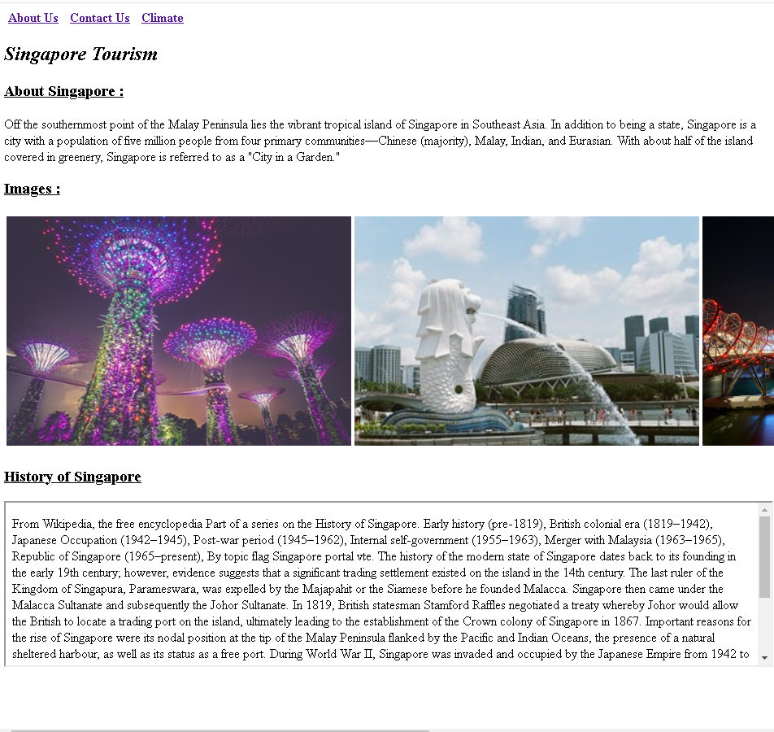
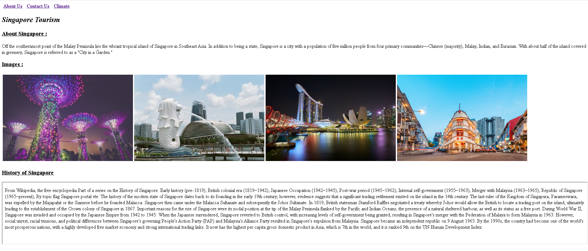
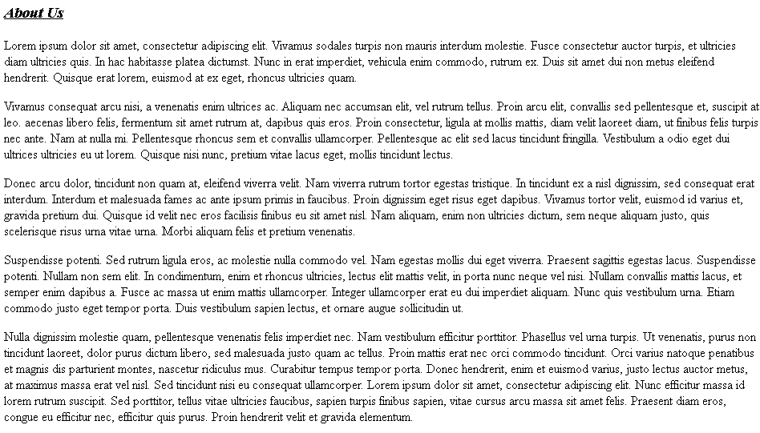
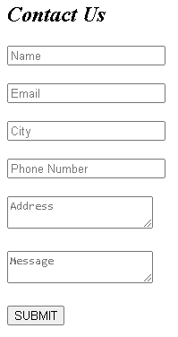
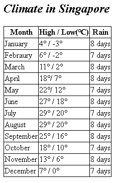

# Singapore Tourism Website

This project is a static HTML webpage created to promote tourism in Singapore. It provides information about various attractions, climate details, and contact information for inquiries.

## Table of Contents

- [Introduction](#introduction)
- [Features](#features)
- [Installation](#installation)
- [Usage](#usage)
- [Screenshots](#screenshots)
- [License](#license)
- [Additional Information](#additional-information)

## Introduction

The Singapore Tourism Website aims to showcase the beauty and attractions of Singapore to potential tourists. It provides essential information about the city's culture, climate, and points of interest. The target audience includes those who are  interested in traveling to Singapore and exploring its rich culture and diverse attractions.

## Features

- **About Us**: Provides information about our tourism company and its services.
- **Contact Us**: Users can use the contact form to get in touch with us for inquiries or feedback.
- **Climate**: Details about the climate of Singapore, including temperature and rainfall data.
- **Images**: A selection of images showcasing the city's landmarks and attractions.

## Installation

To run the Singapore Tourism Website locally, follow these steps:

```
git clone https://github.com/nknithi/singapore-tourism.git
cd singapore-tourism
```

## Usage

Users can navigate through the website using the following pages:

- **Home Page**: General information about Singapore, including culture and attractions.
- **About Us**: Information about our tourism company and services.
- **Contact Us**: Fill out the contact form for inquiries or feedback.
- **Climate**: View details about the climate of Singapore.

## Screenshots

### Home Page




### About Us Page


### Contact Us Page


### Climate Page


## License

This project is not licensed.

## Additional Information

For any questions or further information, please contact [nknithi2018@gmail.com](mailto:nknithi2018@gmail.com).
